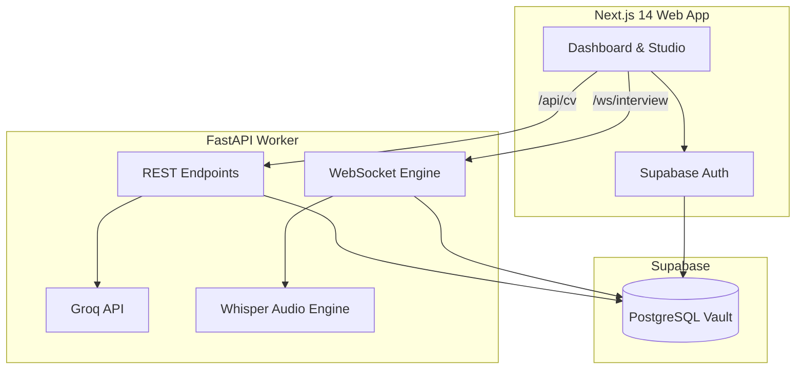

# HireVault: The Ultimate AI-Powered Career Accelerator

[](#)
[](#-tech-stack)
[](./LICENSE)

HireVault is a **Full-Stack Career Acceleration Ecosystem** designed to bridge the gap between job applications and successfully landing offers. Built with a robust **Next.js 14** frontend and a high-performance **FastAPI** Python worker, HireVault transforms the stressful job hunting process into a structured, data-driven workflow.

## ✦ Overview
HireVault empowers users to dynamically tailor their CVs for Applicant Tracking Systems (ATS) and practice for the real deal through conversational, AI-driven mock interviews. By storing your master career profile in the Vault, you can spawn infinite targeted CV variants and immediately jump into live voice or text interviews to test your readiness.

## ✦ Key Features
- **ATS Optimization Studio**: Import, create, and refine CV variants tailored to specific job descriptions. Our parsing engine ensures 100% structural compliance with corporate tracking systems.
- **Conversational AI Mock Interviews**: Practice behavioral and technical interviews via an interactive streaming agent. Face distinct personas (like the "Encouraging Mentor" or "FAANG Hardliner").
- **Live Voice & Code Sandbox**: Answer interview questions using your microphone (powered by real-time Whisper transcription) or write code in a live, shared editor sandbox.
- **Dynamic Dashboard & Analytics**: Monitor your Market Alignment score, track active application links, and easily identify suggested skill gaps missing from your target roles.
- **Ultra-Fast LLM Orchestration**: Powered exclusively by Groq (`llama-3.3-70b-versatile`), offering near-instantaneous structural feedback and lifelike conversational latency.

## ⚙ Tech Stack

| Layer | Technologies |
| :--- | :--- |
| **Frontend** |    |
| **Backend** |    |
| **Database & Auth** |   |
| **AI Core** |   |

## ◈ Architecture
HireVault follows a **Distributed Monorepo** pattern, separating the client-facing UI from heavy AI workloads:
- **Next.js App Router**: Handles Server-Side Rendering (SSR), static routing, client components (Dashboard, Forms), and Supabase Authentication.
- **FastAPI Worker**: An asynchronous Python layer exclusively designed to handle heavy Groq inference requests, PDF generation, and stateful WebSocket connections for live interviews.
- **Supabase**: Centralized PostgreSQL database enforcing strict Row Level Security (RLS) so users can only access their own CV variants and interview transcripts.



## ⌬ Technical Excellence

### ◢ Advanced AI Orchestration
- **Guaranteed JSON Schemas**: Deep integration with Groq's JSON mode guarantees that CV modifications, tailoring, and ATS suggestions return strict, parsable TypeScript interfaces without hallucinating structural fields.
- **Stateful Conversational Memory**: The interview WebSocket preserves historical conversation turns and the candidate's live code sandbox state, passing compressed context to the LLM to maintain a consistent persona.

### ✦ Performance & Scalability
- **Client/Server Component Split**: The frontend is meticulously divided between lightweight interactive Client Components and heavy-lifting Next.js Server Components, ensuring maximum SEO and minimal bundle sizes.
- **Async Python Event Loop**: The FastAPI worker heavily utilizes `asyncio` for non-blocking database queries and concurrent Groq network calls.

## ⎔ Technical Challenges Solved

### 1. Ultra-Low Latency Audio Streaming
**Challenge**: Transmitting chunks of microphone audio data from the browser to the backend without causing massive network overhead or cutting off the user's speech prematurely.
**Solution**: We transitioned from a timeslice-based chunking strategy (which fragmented audio and crashed Whisper) to a blob-accumulation strategy in the `MediaRecorder`. When the user finishes speaking, the complete `webm` blob is streamed over the WebSocket, instantly transcribed by `whisper-large-v3`, and injected into the conversation turn—all in a fraction of a second.

### 2. Complex Relational State Syncing
**Challenge**: Modifying nested arrays of data (e.g., adding a suggested "Skill Gap" to a user's core profile) from a Client Component while ensuring the Next.js server cache remains in sync.
**Solution**: Leveraged direct Supabase client mutations wrapped in a `router.refresh()` lifecycle flow. This bypasses the need for bloated global state managers (like Redux), keeping the UI incredibly snappy while ensuring the PostgreSQL database is the single source of truth.

---

## ⬢ Manual Setup (For Developers)

### 1. Prerequisites
You must have these installed on your machine:
- **Node.js 18+** & **pnpm**
- **Python 3.11+**
- **Supabase Project** & **Groq API Key**

### 2. Environment Setup
1. Clone the repository.
2. Duplicate `.env.example` into `.env` at the root of the project.
3. Fill in your `GROQ_API_KEY`, `NEXT_PUBLIC_SUPABASE_URL`, `NEXT_PUBLIC_SUPABASE_ANON_KEY`, and `SUPABASE_SERVICE_ROLE_KEY`.

### 3. Start the Application
- **Frontend**: In the root folder, run `pnpm install` and then `pnpm dev`.
- **Backend Worker**: 
  ```bash
  cd apps/worker
  python -m venv .venv
  source .venv/bin/activate  # On Windows: .venv\Scripts\activate
  pip install -r requirements.txt
  uvicorn main:app --reload --port 8000
  ```
- **Access**: Open your browser to `http://localhost:3000`.
